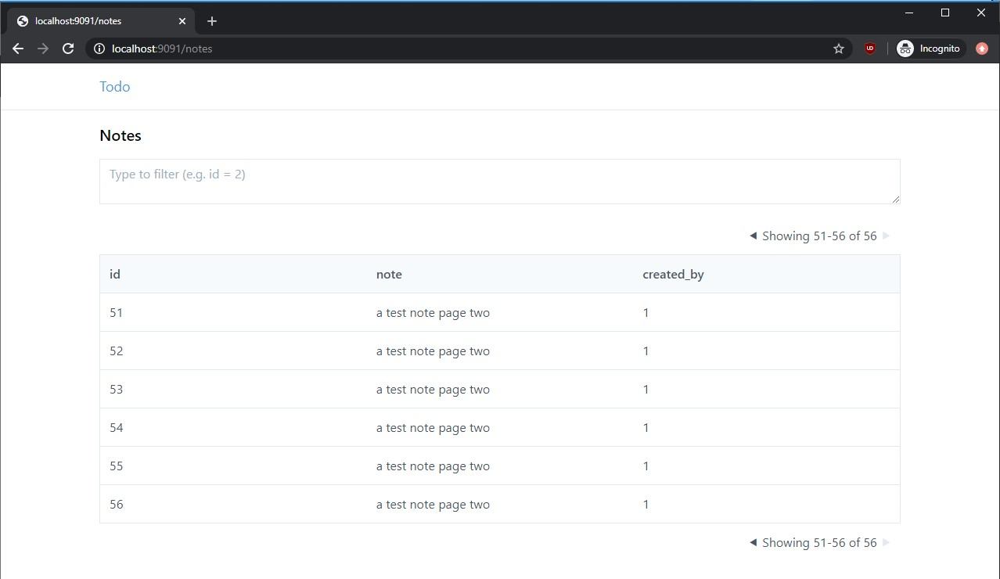

# DBCore (ALPHA)

DBCore is a code generator build around database schemas and an API
specification. Included with DBCore are templates for generating a Go
REST API and React UI.

The API specification supports basic CRUD operations with filtering,
pagination, sorting, and JWT-based username/password authentication.

[See the docs site for more detail.](https://www.dbcore.org)

## Example



To build the todo app:

```bash
$ git clone git@github.com:eatonphil/dbcore
$ cd dbcore
$ dotnet run ./examples/todo
$ cd ./examples/todo/go
$ go build ./cmd/main.go
$ ./main
INFO[0000] Starting server at :9090                      pkg=server struct=Server
... in a new window ...
$ curl -X POST -d '{"username": "alex", "password": "alex", "name": "Alex"}' localhost:9090/users/new
{"id":1,"username":"alex","password":"alex","name":"Alex"}
$ curl 'localhost:9090/users?limit=25&offset=0&sortColumn=id&sortOrder=desc' | jq
{
  "total": 1,
  "data": [
    {
      "id": 1,
      "username": "alex",
      "password": "alex",
      "name": "Alex"
    },
  ]
}
```

And to build the UI:

```
$ cd examples/todo/browser
$ yarn start
```

## Dependencies

* Go
* PostgreSQL, MySQL or SQLite3
* .NET Core

## Restrictions

There are a bunch of restrictions! Here are a few known ones. You will
discover more and you may fix them!

* Only tables supported (i.e. no views)
* Only single-column foreign keys supported
* Only Go API, React UI templates provided
