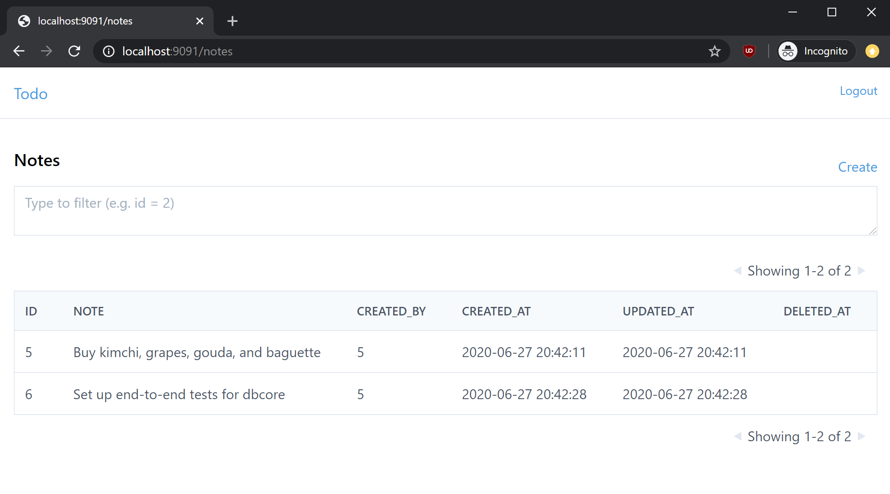

# DBCore (ALPHA)

DBCore is a code generator build around database schemas and an API
specification. Included with DBCore are templates for generating a Go
REST API and React UI.

## Features and API specification

While the DBCore project can build any templates from your
database. It also defines an API specification with useful
functionality for rapidly standing up an API around your database.

Because DBCore does code generation, it can build well-typed code. The
built-in Go API templates are a great example of this.

But since the API specification is language-agnostic, all these
features are supported no matter what language you use to generate a
DBCore API.

Major features include:

* Get one, get many, create, edit, delete endpoints
* Filtering, sorting, pagination
* JWT-based authentication, per-endpoint/method SQL filter-based authorization

Upcoming features include:

* Lua-based hooks and transformations
* SSO integration

[See the docs site for more detail.](https://www.dbcore.org)

## Example



There's a built-in notes application with non-trivial
authorization. Users belong to an org. Notes belong to a user. Notes
that are marked public don't need a session. Otherwise they can only
be viewed by other users within the same org. Only org admins or the
notes creator can modify a note.

```bash
$ git clone git@github.com:eatonphil/dbcore
$ cd dbcore
$ make example-notes
$ cd ./examples/notes/api
$ ./main
INFO[0000] Starting server at :9090                      pkg=server struct=Server
... in a new window ...
$ curl -X POST -d '{"username": "alex", "password": "alex", "name": "Alex"}' localhost:9090/users/new
{"id":1,"username":"alex","password":"alex","name":"Alex"}
$ curl 'localhost:9090/users?limit=25&offset=0&sortColumn=id&sortOrder=desc' | jq
{
  "total": 1,
  "data": [
    {
      "id": 1,
      "username": "alex",
      "password": "alex",
      "name": "Alex"
    },
  ]
}
```

And to build the UI:

```
$ cd examples/notes/browser
$ yarn start
```

Log in with any of the following credentials:

* admin:admin (Org 1)
* notes-admin:admin (Org 2)
* editor:editor (Org 2)

## Dependencies

* Go
* PostgreSQL, MySQL or SQLite3
* .NET Core

## Restrictions

There are a bunch of restrictions! Here are a few known ones. You will
discover more and you may fix them!

* Only tables supported (i.e. no views)
* Only single-column foreign keys supported
* Only Go API, React UI templates provided
