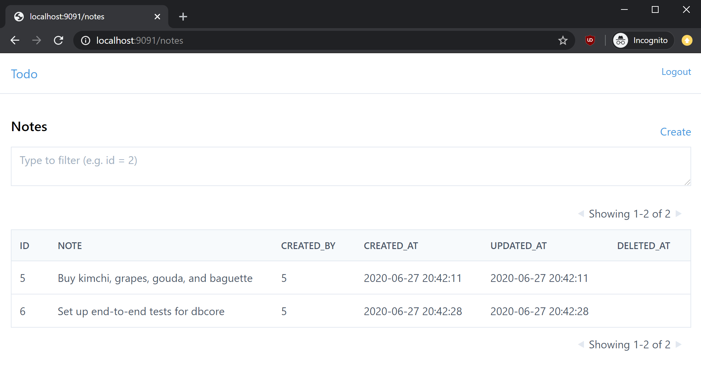

## Example



This is a built-in notes application with non-trivial
authorization. Users belong to an org. Notes belong to a user. Notes
that are marked public don't need a session. Otherwise they can only
be viewed by other users within the same org. Only org admins or the
notes creator can modify a note.

```bash
$ git clone git@github.com:eatonphil/dbcore
$ cd dbcore
$ make example-notes
$ cd ./examples/notes/api
$ ./main
INFO[0000] Starting server at :9090                      pkg=server struct=Server
... in a new window ...
$ curl -X POST -d '{"username": "alex", "password": "alex", "name": "Alex"}' localhost:9090/users/new
{"id":1,"username":"alex","password":"alex","name":"Alex"}
$ curl 'localhost:9090/users?limit=25&offset=0&sortColumn=id&sortOrder=desc' | jq
{
  "total": 1,
  "data": [
    {
      "id": 1,
      "username": "alex",
      "password": "alex",
      "name": "Alex"
    },
  ]
}
```

And to build the UI:

```
$ cd examples/notes/browser
$ yarn start
```

Log in with any of the following credentials:

* admin:admin (Org 1)
* notes-admin:admin (Org 2)
* editor:editor (Org 2)
